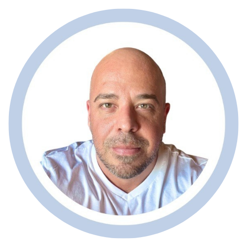

  

<h1 align="center">🧬 TERYXON – Digital Excellence</h1>

  From the Heart of Europe to the Pulse of New York 
  <em>Diagnose. Build. Grow.</em>

---

## 🚀 Engineering ideas into business reality.  
### Diagnose. Build. Grow.

**Teryxon** is a digital engineering company that connects **data and execution**.  
We build scalable SaaS products and deliver AI-assisted diagnostics for business visibility.

Our mission:  
> “To engineer digital excellence — from data to decision, from decision to product.”

---

## 🧩 The TERYXON Model

### **1️⃣ Teryxon Diagnosis**
AI-assisted SaaS that analyzes your online performance and delivers monthly clarity diagnosis.  
- Automated Data Collection  
- AI-Powered Interpretation  
- Business Visibility Dashboards  
- No contracts, monthly insights  

👉 [Learn more](https://www.teryxon.com/diagnosis)

---

### **2️⃣ Teryxon Core**
Engineering framework and MVP development system for startups and SaaS founders.  
- Laravel + React Architecture  
- Scalable Backend + Modular Frontend  
- Built-in Auth, Billing, CI/CD  
- Production-ready MVPs  

👉 [Explore Teryxon Core](https://www.teryxon.com/core)

---

## ⚙️ Why Companies Work With Teryxon

✅ Data + Engineering in one ecosystem  
✅ Laravel & React SaaS development expertise  
✅ Diagnostic → Development → Growth loop  
✅ Secure, DevOps-ready architecture  
✅ Global mindset, European precision  

---

## 🛠️ TERYXON CORE Tech Stack

| Layer | Technology |
|--------|-------------|
| **Backend** | Laravel, REST APIs, Redis, Queues |
| **Frontend** | React, Zustand, React Query, Vite |
| **UI** | Tailwind CSS |
| **Database** | MySQL, Redis |
| **Ops** | Docker, CI/CD pipelines |
| **AI/Analysis** | OpenAI API, DataForSEO integration |

---

## 💡 About Teryxon

Teryxon operates as a **two-pillar system**:  
- **Teryxon Core** builds the products.  
- **Teryxon Diagnosis** measures and improves their impact.  

Together, they create a continuous feedback loop for **Digital Excellence**.

---

## 👤 Founder

  

  <strong>Peter Muladi</strong> 
  Founder & Lead Engineer, <a href="https://www.teryxon.com" target="_blank">Teryxon</a> 
  <em>“We don’t just code — we build engines for digital excellence.”</em>

📩 hello@teryxon.com  
🌐 [www.teryxon.com](https://www.teryxon.com)

---

## 📦 Collaboration

Let’s build something extraordinary.  
Whether you’re launching your MVP or analyzing business performance,  
**Teryxon** helps you move from insight to execution.

🔗 [Visit Our Website](https://www.teryxon.com)  
📬 [Get in Touch](mailto:hello@teryxon.com)

---

  <strong>📍 From the Heart of Europe to the Pulse of New York 🌍</strong> 
  <em>Engineering Digital Excellence</em>

